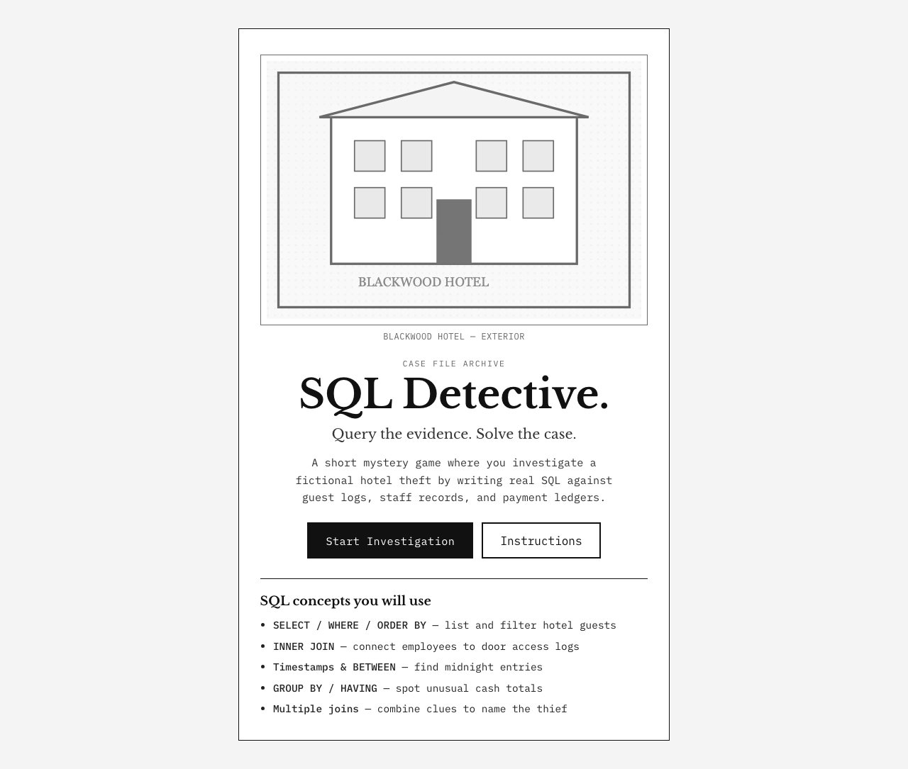
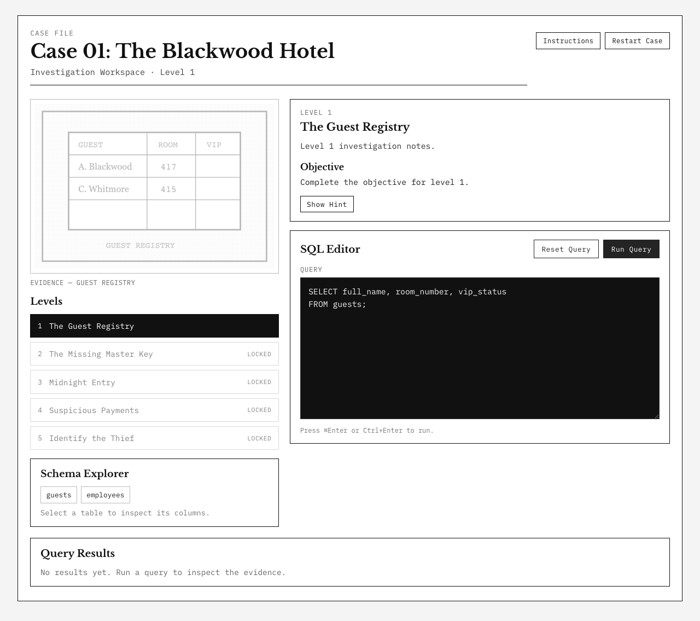

# SQL Detective

**Query the evidence. Solve the case.**

A short black-and-white mystery game where you investigate a fictional hotel theft by writing real SQL against guest logs, staff records, door access, and payments. One case, five levels, no accounts.

## Features

- Case 01: The Blackwood Hotel — five beginner-to-intermediate SQL challenges
- Live query execution against PostgreSQL with read-only safeguards
- Schema explorer, SQL editor, results table, and level progress
- Local progress and per-level SQL drafts (browser `localStorage`)
- Case Closed report once the thief is identified

## Tech stack

- **Frontend:** React, TypeScript, Vite, CSS, Vitest, Playwright
- **Backend:** Java 21, Spring Boot 3, Spring JDBC, JSqlParser
- **Database:** PostgreSQL 16, Flyway
- **CI:** GitHub Actions

## Architecture

```
React UI  -->  Spring Boot API  -->  PostgreSQL
                |                     ^
                +-- read-only role ---+
```

The UI loads case content and challenges from the API, then posts player SQL to an execute endpoint. The backend validates that each statement is a single read-only `SELECT`, runs it with a restricted database role, compares the result to a hidden expected query, and returns feedback without exposing answer SQL.

## Screenshots





## Local setup

### Prerequisites

- Node.js 20+
- Java 21+
- Docker (Compose plugin recommended: `docker compose`)

### 1. Environment

```bash
cp .env.example .env
```

Defaults match `application.yml` (`sql_detective` / `sql_detective`). If your `.env` uses different credentials, export the matching `SPRING_DATASOURCE_*` variables before starting the backend.

### 2. Start PostgreSQL

```bash
docker compose up -d
```

If the Compose plugin is unavailable:

```bash
docker run -d --name sql-detective-db \
  -e POSTGRES_DB=sql_detective \
  -e POSTGRES_USER=sql_detective \
  -e POSTGRES_PASSWORD=sql_detective \
  -p 5432:5432 \
  postgres:16-alpine
```

### 3. Start the backend

```bash
cd backend
./mvnw spring-boot:run
```

API health: [http://localhost:8080/api/health](http://localhost:8080/api/health)

### 4. Start the frontend

```bash
cd frontend
npm install
npm run dev
```

App: [http://localhost:5173](http://localhost:5173)

## Testing

```bash
# Frontend unit tests + typecheck + production build
cd frontend
npm run typecheck
npm test
npm run build

# Frontend end-to-end (builds, then Playwright)
npm run test:e2e

# Backend tests + package
cd backend
./mvnw test
./mvnw package -DskipTests
```

## Read-only SQL

Player queries are restricted on two layers:

1. **Parser checks** — only a single `SELECT` (including CTEs) is accepted; writes, multi-statements, and dangerous clauses are rejected with friendly feedback.
2. **Database role** — accepted queries run as `sql_detective_readonly`, which has `SELECT` only on investigation tables (`guests`, `employees`, `room_access_logs`, `payments`, `evidence_items`). The `challenges` table is not readable by that role.

## License

Personal project. Original SVG evidence illustrations are created for this repository.
