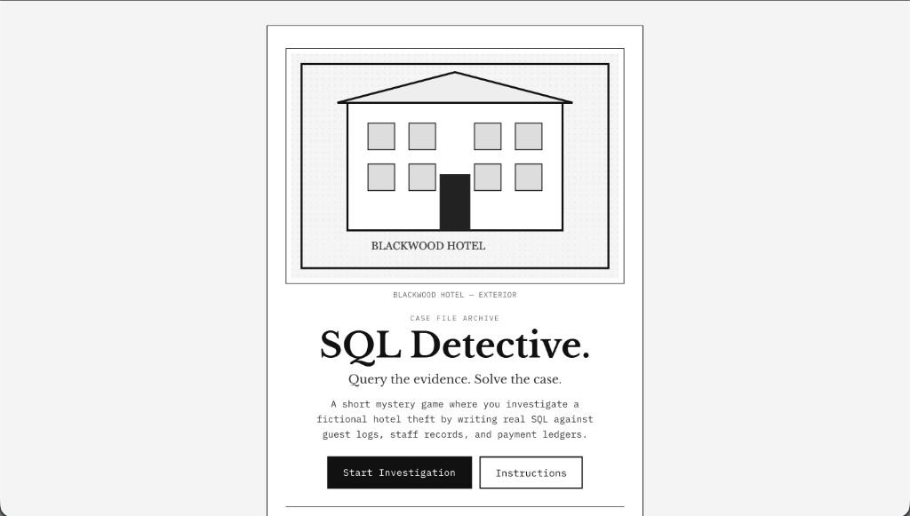
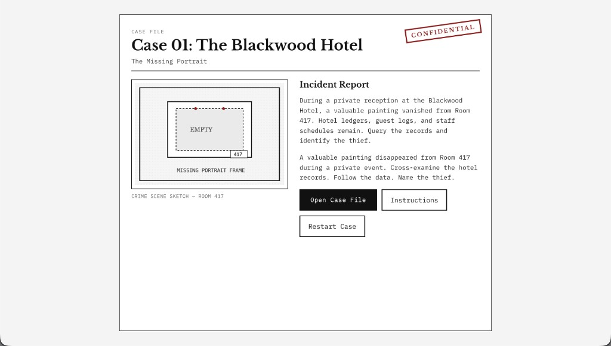
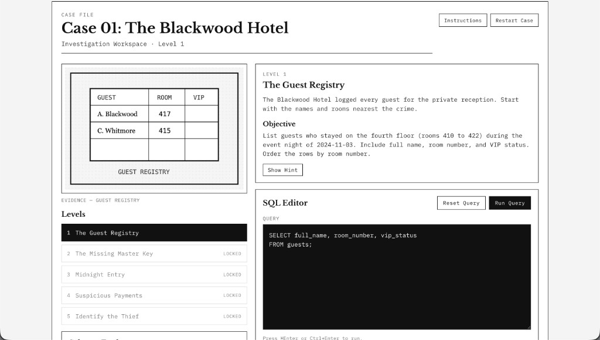
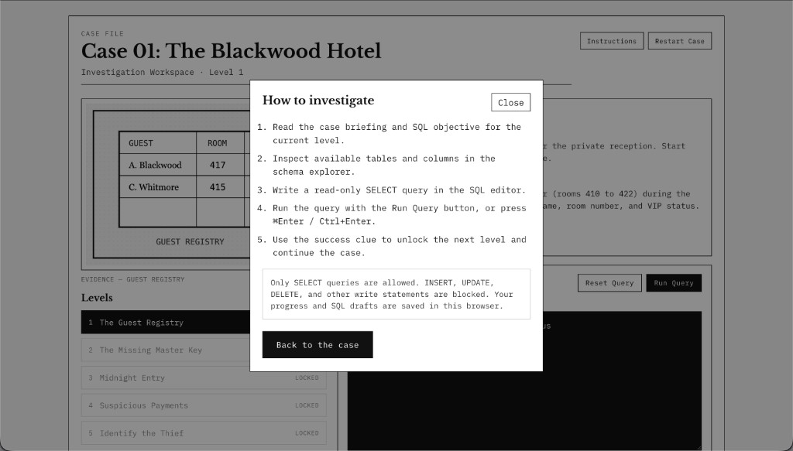
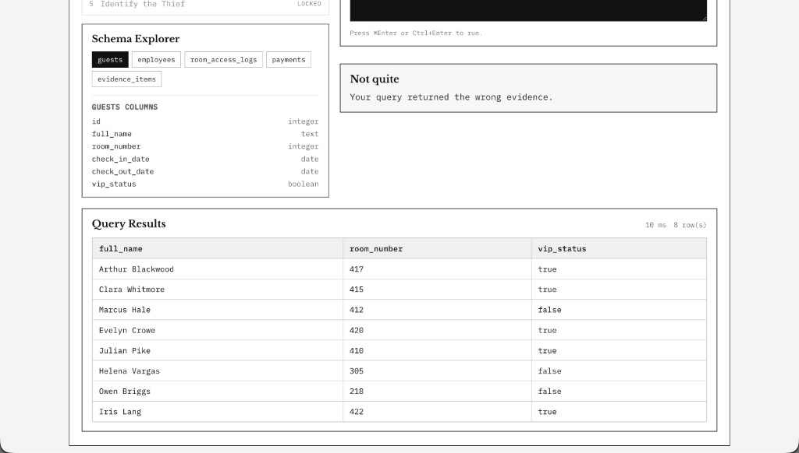

# SQL Detective

**Query the evidence. Solve the case.**

A short mystery game where you investigate a fictional hotel theft by writing real SQL against guest logs, staff records, access logs, and payments. One case, five levels, no accounts.

## Architecture

```
React UI  →  Spring Boot API  →  PostgreSQL
                 │
                 └── read-only role for player queries
```

The frontend loads challenges from the API and sends SQL to an execute endpoint. The backend accepts only a single read-only `SELECT`, runs it with a restricted database role, and compares the result to a hidden expected query.

**Stack:** React, TypeScript, Vite · Java 21, Spring Boot · PostgreSQL, Flyway

## Game Preview

Landing page



Case introduction



Investigation workspace



Instructions



Query results and feedback



## Local setup

```bash
cp .env.example .env
docker compose up -d

cd backend && ./mvnw spring-boot:run
cd frontend && npm install && npm run dev
```

App: [http://localhost:5173](http://localhost:5173) · API: [http://localhost:8080/api/health](http://localhost:8080/api/health)

## Inspiration

Inspired by the popular [SQL Murder Mystery](https://mystery.knightlab.com/).
